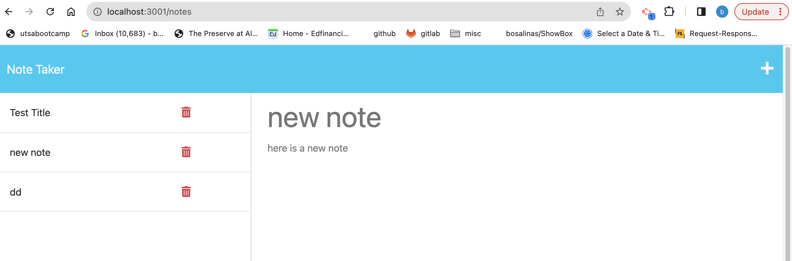

# NoteTaker

## Description 

The following project is a note taking application where a user can write and save notes to organize thoughts and tasks as needed . 
Upon opening the application is a user is presented with existing notes on the left-hand column and an empty field to enter new notes on the right-hand column. 

## Visuals

## Table of Contents

- [Installation](#installation)
- [Usage](#usage)
- [Credits](#credits)
- [Questions](#questions)

## Installation

To run application use the terminal in the correlating file and type 'node server.js'. The port link will display and then user must select it and use application in correlating browser. 

## Usage

When application is open, a user will be presented with the Write icon in the navigation at the top of page, they are then presented with empty fields to enter a new note title and note text. The user can select the Save icon that appears after entering a note title and text . The newly added note will display on the left-hand size with the other saved notes. 

## Credits

For this project I had the Learning Assistant (AskBCS) help me combine my routes into one server.js file and deploy the application successfully on the local host. My tutor Katie helped me with my note id's and start the delete feature. 

## Questions

For any questions, please contact me @ 
https://github.com/bramirez09
or
Email: bramirez09@icloud.com